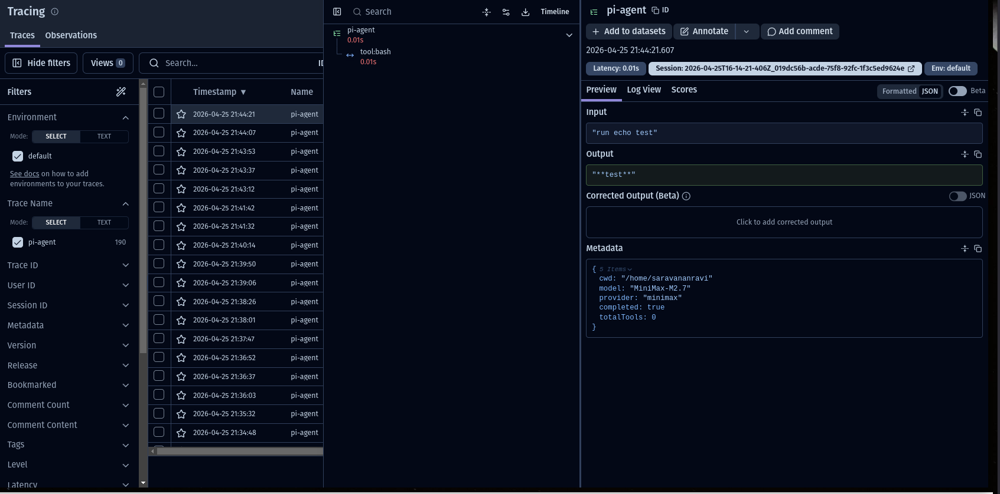

# @ravan08/pi-langfuse

[](https://www.npmjs.com/package/@ravan08/pi-langfuse)
[](https://opensource.org/licenses/MIT)

Langfuse observability extension for [Pi Coding Agent](https://github.com/mariozechner/pi-coding-agent). Sends traces to [Langfuse](https://langfuse.com) for monitoring tokens, costs, latency, and tool calls.



## Why Langfuse?

Langfuse provides open-source observability for LLM applications. This extension allows you to **trace**, **monitor**, and **debug** your Pi sessions with production-grade detail, helping you understand exactly how your agent is performing, what it's costing you, and where it might be failing.

## Features

- **Hierarchical Tracing**: Maps user prompts to per-turn spans and nested tool executions for deep visibility.
- **LLM Metadata**: Automatically records model name, provider, token usage, and API costs per turn.
- **Tool Observability**: Detailed logs for every tool call, including arguments, results, and error states.
- **Session Correlation**: Groups all prompts from the same Pi session into a single Langfuse session.
- **Cost Tracking**: Records input/output/total costs in USD per generation.
- **Token Usage**: Tracks input and output tokens per turn.

## Quick Install

### Via npm (recommended)
```bash
pi install npm:@ravan08/pi-langfuse
```

### Via git
```bash
pi install git:github.com/saravananravi08/pi-langfuse-extension
```

## Configuration

Get your keys from [Langfuse Cloud](https://cloud.langfuse.com) → Settings → API Keys.

Create `config.json` in the extension directory:

```json
{
  "publicKey": "pk-lf-xxxx",
  "secretKey": "sk-lf-xxxx",
  "host": "https://cloud.langfuse.com"
}
```

For npm install, find the extension at:
```
~/.pi/agent/npm/@ravan08/pi-langfuse/index.ts
```

## Usage

### Run pi with tracing enabled

```bash
pi "your prompt"
```

Pi auto-loads the extension. All sessions will be traced to Langfuse.

## Trace Model

```
Trace (name: "pi-agent")
├── Session ID: <pi-session-id>
├── Metadata: model, provider, cwd
└── Span (name: "tool:<name>")
    └── Input/Output logs

Generation (name: "llm-response")
├── Model: MiniMax-M2.7
├── Usage: input/output tokens
└── Cost: input/output/total USD
```

## What Gets Tracked

### Trace Level
- `input` - User prompt
- `output` - Assistant response
- `sessionId` - Pi session identifier
- `metadata` - Model, provider, cwd

### Generation Observations (LLM Calls)
- `model` - Model identifier (e.g., "MiniMax-M2.7")
- `usage` - Token counts (input/output/total)
- `costDetails` - Cost breakdown in USD

### Span Observations (Tool Calls)
- `name` - Tool name (e.g., "tool:bash")
- `input` - Tool parameters (JSON)
- `output` - Tool result
- `metadata.isError` - Whether tool failed

## Langfuse Dashboard

After running, check your Langfuse project for:

1. **Traces** - All pi agent runs with I/O
2. **Sessions** - Traces grouped by session ID
3. **Observations** - Tool calls and LLM generations
4. **Scores** - Token counts and costs
5. **Model Usage** - Usage breakdown by model

## Architecture

For a deep dive into the tracing model and data flow, see [docs/architecture.md](./docs/architecture.md).

## Troubleshooting

**No traces appearing?**
- Verify API keys are correct in `config.json`
- Check Langfuse project is active
- Ensure API keys have write permissions

**Extension not loading?**
- Run `pi list` to check installed packages
- Try restarting pi

**Model/cost not showing?**
- Not all providers expose cost info
- Check Langfuse traces API for raw observation data

## Dependencies

- [langfuse](https://www.npmjs.com/package/langfuse) - Langfuse SDK
- [@mariozechner/pi-coding-agent](https://www.npmjs.com/package/@mariozechner/pi-coding-agent) - Pi extension API

## License

MIT